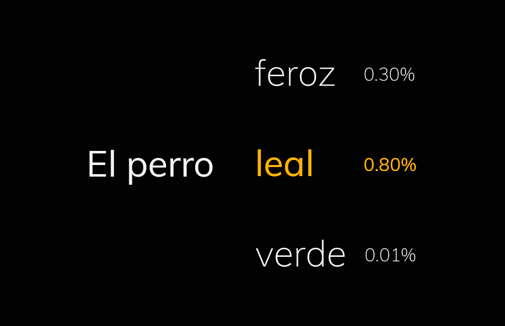
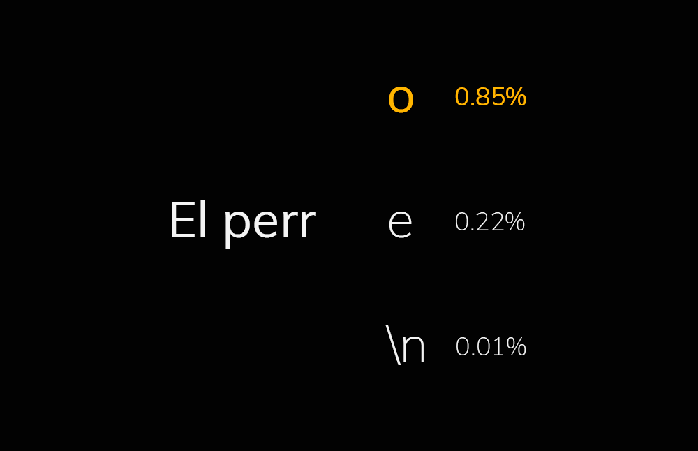
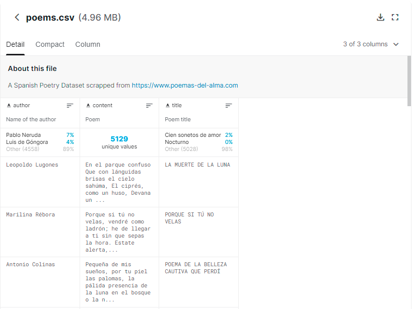
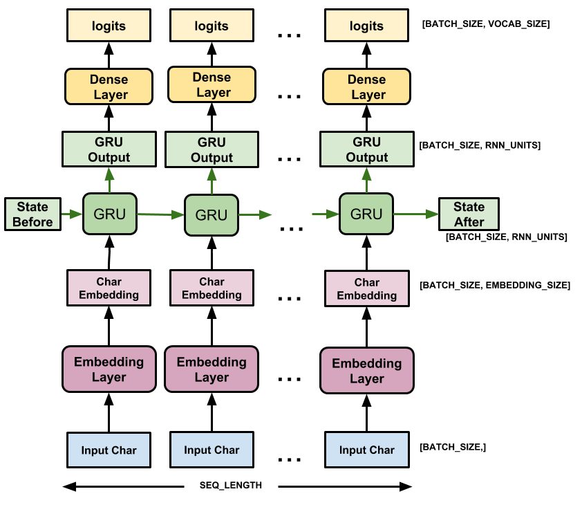

# Spanish Poetry Generator
## Introduction
My goal with this project was to improve my knowledge on the Natural Language Processing field. My experience with this area was very limited; only a few projects related to simple text classification models with RNN.

I had a few inspirations in order to start this project. The first one is a Kaggle dataset that I've found with thousands of Spanish poems. In addition, some tutorials from the Tensorflow team and a project, that I've found a few years ago, related to the automatic generation of Kayne West songs. All those things encouraged me to start developing this project.

## Problem Approximation

Once I started my research, I found that the 2 main approaches to my problem are the generation of text using word-level or char-level techniques. As I was new to this area, I didn't know which technique would have fitted best with my dataset, so I implemented both of them.

The generation of the poems using word-level techniques is very simple: based on the context of the sentence you try to predict the word that will fit better. The problem with this technique is that the model doesn't learn the meaning of the sentence and, in most cases, the poem generated does not have any sense. In addition, you have to store all the different words of your dataset as different tokens so the output layer will be so prominent.

There is also a problem with the structure of the poem. Doing the word-based prediction the poem will never have the typical structure of a poem, it will always be a long sentence.

On the other hand, the generation of the poems using char-level techniques is also very simple: based on the context of the sentence you try to predict the char that will fit better. The problem with this technique is that the model doesn't learn the meaning of the sentence, as in the word-level. However, using this technique the output layer will only have the different characters found on the dataset (much less than the number of different words).

Using this approach the model will be able to generate the structure of the poem but there will be some structures and some words that do not even exist.

## Dataset

As I told at the beginning, the dataset is composed of thousands of poems from different writers in Spanish. At first, I thought that the dataset was perfect for my project but, once I started training the models, I found some problems that I will try to prevent in the future.

The main problem is that, although the dataset has a lot of text to process (which is always good), the number of different authors and the different years make the vocabulary used huge. Even after some normalization to the data, the number of different words on the poems was too big for the word-based model. For future projects, I've learned that is a much better option to choose a concrete author or a concrete period.

## Neuronal Network

For the word-based model, the first thing I had to do is normalize all the poems. The process consisted on removing all the special symbols, convert to lower all the words and, finally, remove all the extra spaces of the poems. Once all this was done, I joined all the poems into a big string that will be batched in the training process.

Once all the text is preprocessed, is time to generate the n-grams that we will use to train the model. For this model and the size of the vocabulary, I had to reduce a lot the training vocabulary due to memory issues. Once everything is ready, is time to train the model. The architecture is a basic Embedding as the input, then we have a Bidirectional LSTM and, as the output layer, we have a dense layer with the size of the vocabulary.

https://user-images.githubusercontent.com/46010361/176541995-2a63d2fd-d6a1-4363-9e61-a3e6e2eaab1d.mp4

For the char-model based, the normalization of the dataset is more or less the same. In this case, I had to remove some extra characters and the dataset provided to the model is now divided by characters. The model architecture for this case is the one proposed by Tensorflow in a similar project. This architecture, given a character and the states of the previous characters (the context), is able to predict the next one.

This time, thanks to the technique used, we don't have to reduce the size of the dataset in order to train it.

https://user-images.githubusercontent.com/46010361/176542025-dd79f060-580f-4d86-b530-b10a453276bc.mp4

## Web implementation

Now that we can compare the 2 models, I decided that the best model (for this project and this dataset) was the char-based. Although some words generated doesn't have any sense, the structure generated for the poem is much more visual for web implementation. In this case, the web implementation is not done with Tensorflow.js because the model used can not easily be exported.

https://user-images.githubusercontent.com/46010361/176542045-e4232317-6b43-400b-8e6f-cf32dfe7207f.mp4

This demo can be used by clicking the play button of this project on the main page.

## Conclusion

During the development of this project, I've learned a lot. I've increased my knowledge related to the NLP field learning things like the Embeddings. I've also learned how to normalize and process a text dataset. Most of the times, I have used a preprocessed dataset and having to do it by myself this time was a challenge.

Finally, and most importantly, during the development I've learned to stop, to finish a project. I've noticed that sometimes you have limitations and you have to finish the project (even if it's not perfect) and learn new things. And once I get more knowledge in this area, I'm sure that I will be able to create a much more efficient text-generator.
